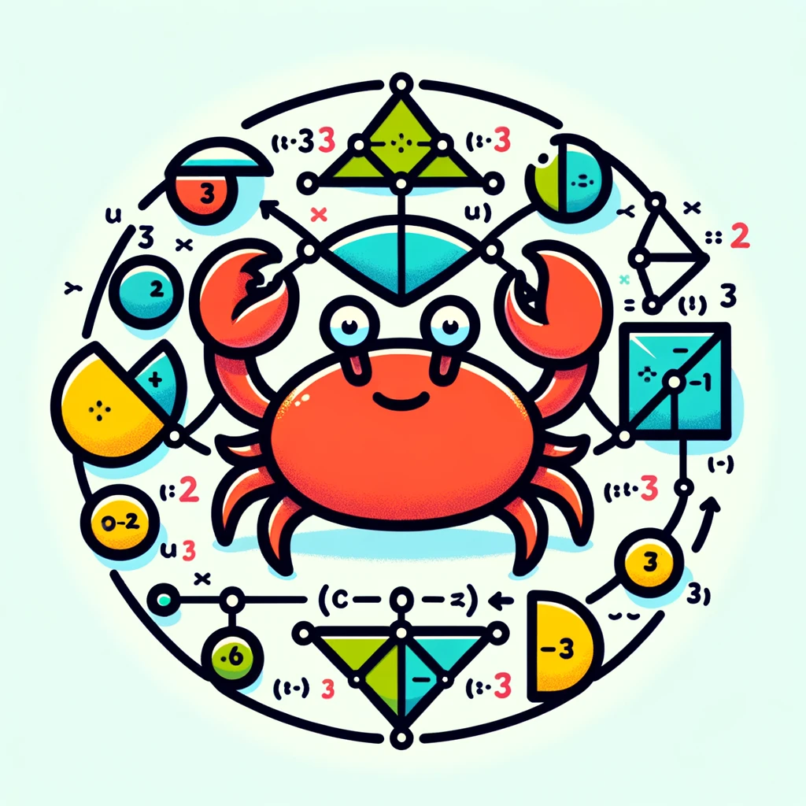

### Rust - Set Theory
Rust used to map set structures and operations

<h1 align="center">
  
</h1>

### Examples
```rust
    let a: FiniteSet<i32> = FiniteSet {
        label: "A".to_string(),
        values: vec![
            1, 2, 3, 4, 5, 6, 7
        ],
    };

    let b = FiniteSet {
        label: "B".to_string(),
        values: vec![1, 2, 8],
    };

    println!("{} {} {}", a.label, a.has_element(4), 4); // A ∈ 4
    println!("{} {} {}", b.label, b.has_element(10), 10); // B ∉ 10

    println!("{} {} {}", a.label, a.include(&b), b.label); // B Ȼ 10
    println!("{} {} {}", b.label, b.include(&a), a.label); // B Ȼ A

    println!("{} -> {:?}", a.union(&b).label, a.union(&b).values); // A ∪ B -> [1, 2, 3, 4, 5, 6, 7, 8]
    println!("{} -> {:?}", b.intersect(&a).label, b.intersect(&a).values); // B ∩ A -> [1, 2]
```

### Ref
- https://github.com/p2js/set-theory
- https://en.wikipedia.org/wiki/Set_theory
